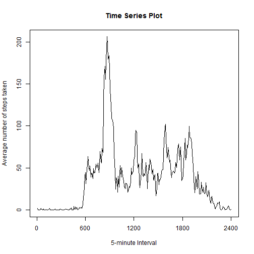

##Q1 - Loading and preprocessing the data

We assume that the file activity.csv is already in the directly.
Read in the CSV file now.


```r
activity.data <- read.csv("activity.csv",header=TRUE)
```

Clean the data by removing NA values from column step. Data should now be in a format ready for further analysis.


```r
activity.data.clean <- activity.data[complete.cases(activity.data),]
head(activity.data.clean)
```

```
##     steps       date interval
## 289     0 2012-10-02        0
## 290     0 2012-10-02        5
## 291     0 2012-10-02       10
## 292     0 2012-10-02       15
## 293     0 2012-10-02       20
## 294     0 2012-10-02       25
```
    
    
##Q2 - What is mean total number of steps taken per day?

Get required data to make histogram of the total number of steps taken each day.


```r
tempdata <- tapply(activity.data.clean$steps,activity.data.clean$date,sum)
tempdata <- tempdata[!is.na(tempdata)]
```

Now plot the histogram.


```r
hist(tempdata,ylim=c(0,20),breaks=10, xlab="steps", main="Histogram of the total number of steps taken each day")
```

 

Calculate and report the mean and median of the total number of steps taken per day.


```r
meandata <- as.integer(mean(tempdata))
mediandata <- as.integer(median(tempdata))
```
The mean of the number of steps taken per day is 10766.    
The median of the number of steps taken per day is 10765.
    
##Q3 - What is the average daily activity pattern?    

Extract data for average steps per day group by interval type. Then plot the result.


```r
tempdata <- tapply(activity.data.clean$steps,activity.data.clean$interval,mean)
#Plot the result
plot(tempdata,type="l",xaxt="n",xlab="5-minute Interval",ylab="Average number of steps taken",main="Time Series Plot")
axis(1, at=seq(0,288,by=288/4),labels=c(0,600,1200,1800,2400))
```

 

Find the 5-minute interval which has the max number of steps.


```r
m <- max(tempdata)
maxstep <- names(which(tempdata==m))
```
The 5-minute interval which has the max number of steps is 835.
    
    
##Q4.Imputing Missing Values

Find the total number of missing values in the dataset.


```r
missingvalue <- nrow(activity.data)-nrow(activity.data.clean)
```

The total number of missing values = 2304.
      
Fill in the missing value using mean value of steps as replacement 


```r
#Work on duplicate data, preserve original.
data <- activity.data

#Create interval mean data frame with interval and mean.steps columns
interval.mean.df <- data.frame(interval=unique(activity.data$interval), mean.steps=tempdata)
#Find missing interval from activity data
missing.interval <- activity.data[is.na(activity.data$steps),"interval"]

#where to pick up the values from interval.mean.df?
indices.in.meandata <- match(missing.interval,interval.mean.df$interval)

#Now write the missing values. data is now the new data set with missing values filled in
data[is.na(data$steps),"steps"] <- interval.mean.df[indices.in.meandata,"mean.steps"]
```

Now make the histogram of total number of steps taken each day with the new data.

```r
tempdata <- tapply(data$steps,data$date,sum)

hist(tempdata,ylim=c(0,30),breaks=10,xlab="steps",main="Histogram of the total number of steps taken each day")
```

 

Calculate mean and median total number of steps taken per day.


```r
meandata.no.missing <- as.integer(mean(tempdata))
mediandata.no.missing <- as.integer(median(tempdata))

delta.mean <- meandata.no.missing - meandata
delta.median <- mediandata.no.missing - mediandata
```

The mean of the number of steps taken per day is 10766.
The median of the number of steps taken per day is 10766.
Difference between the 2 means are 0.
Difference between the 2 medians are 1.
     
There is virtually no difference with the first part of the assignment. Recall that in the first part of my assignment I have removed the missing data. Imputing missing values in this case did not make any difference.
    
##Q5.Are there differences in activity patterns between weekdays and weekends?


```r
data$date <- as.Date(data$date, "%Y-%m-%d")
data$dayofweek <- weekdays(data$date)
data$dayofweek <- ifelse(data$dayofweek %in% c("Saturday","Sunday"),"Weekend","Weekday")
data$dayofweek <- as.factor(data$dayofweek)
```


```r
weekend.data <- subset(data,data$dayofweek == "Weekend")
weekend.data <- tapply(weekend.data$steps,weekend.data$interval,mean)
weekend.df <- data.frame(steps=as.integer(names(weekend.data)),mean=weekend.data,dayofweek="Weekend")
weekday.data <- subset(data,data$dayofweek == "Weekday")
weekday.data <- tapply(weekday.data$steps,weekday.data$interval,mean)
weekday.df <- data.frame(steps=as.integer(names(weekday.data)),mean=weekday.data,dayofweek="Weekday")
c.data <- rbind(weekend.df,weekday.df)
c.data$steps <- as.integer(c.data$steps)

#Plot the result
library(ggplot2)
x=seq(0,2400,600)
g<-ggplot(data=c.data,aes(x=steps,y=mean))
g<-g+geom_line(aes(group=dayofweek))+facet_grid(dayofweek~.)
g<-g+scale_x_continuous(breaks=x,labels=as.character(x))
g<-g+ggtitle("Time Series Plot")
g
```

 

